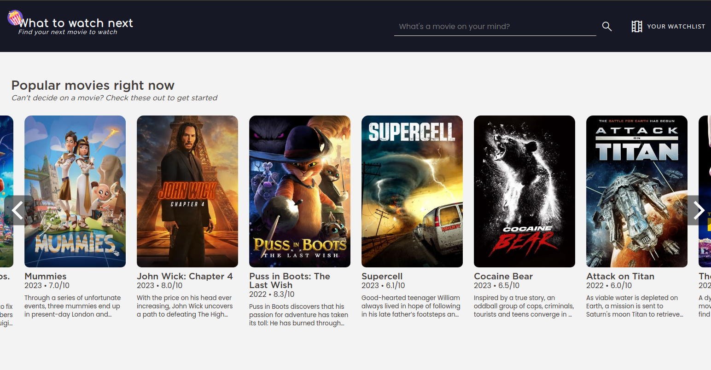
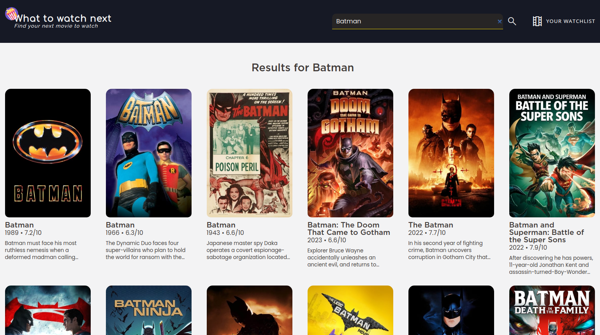
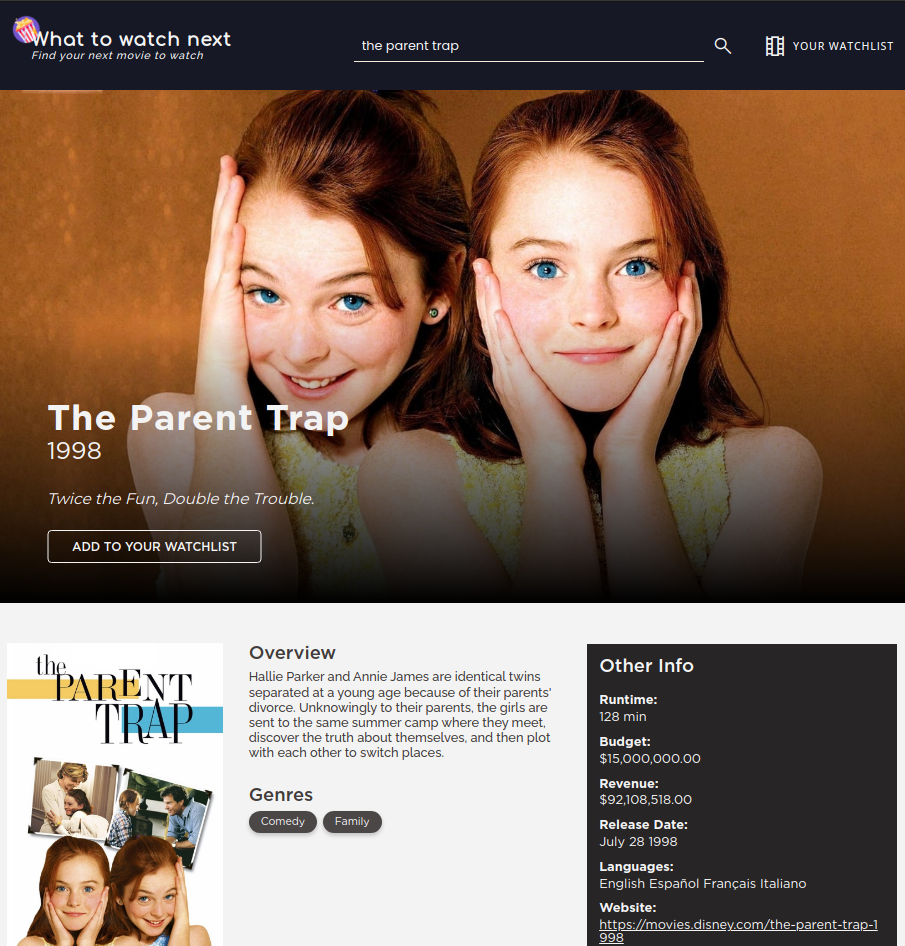

# Project: What to Watch Next

[**Live version** of the site can be found here](https://what-to-watch-next.vercel.app/)

**What to Watch Next** is an app to help you find the next movie to watch! Simply search for movies that you like and the app will give you recommendations. This app uses [The Movie Database](http://themoviedb.org/)'s API to fetch all movie-related metadata.

### Features

1. **Watchlist**: The app features a watchlist where users can add movies that they like for future reference.

2. **Movie Search**: Search for a movie you've watched and the app will show you the details of that movie.

3. **Movie Recommendations**: You can get get an assortment of recommendations for movies that you like.

### Technologies Used

- Typescript
- Vite + React
- React Router
- Framer Motion
- Vitest + React Testing Library
- Sass

### Credits/Acknowledgments

This project is for personal use only. I do not own any of the rights for the assets used in this project.

All film-related metadata used in What-to-watch-next, including actor, director, studio names, synopses, release dates, and poster art is supplied by [The Movie Database](http://themoviedb.org/)

### Display

Home Page

Search Page

Movie Details Page

### Notes

This project served as my first every Typescript project, as well as a way to further explore web accessibility, API calling, and also the features of React Router and Vitest/React Testing Library.

### To-do

1. A section to show where the current movies are being played/shown/streamed.

2. Possibility to include TV shows as well, but would require a huge undertaking.

---

Developed by **Renchester Ramos**
